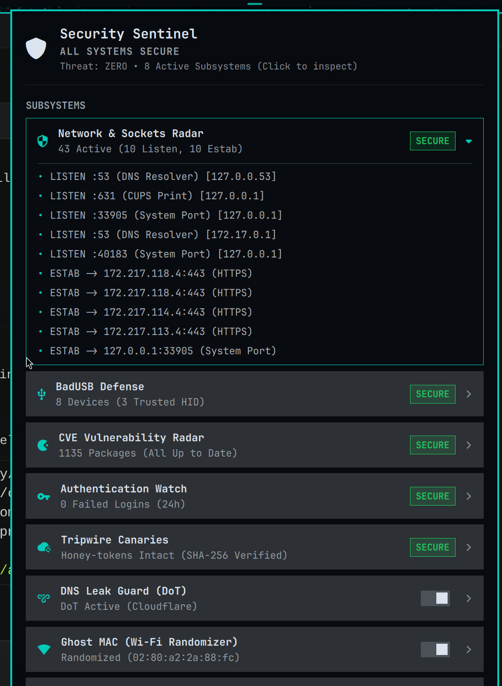

# 🛡️ Security Sentinel Hub • Unified Cyber Defense & Privacy Hub

> **All-in-one native cyber defense, hardware integrity, and privacy sentinel plugin for Omarchy Linux.**

Author: **Ozan Özdil (ozdil)**  
License: **MIT**  
Plugin ID: `ozdil.security-sentinel`

---

## ✨ Overview

**Security Sentinel Hub** unifies 8 essential Linux defense and privacy subsystems into a single high-performance native Rust daemon (`sentinel-engine`) with an integrated, theme-harmonized Omarchy Quickshell dashboard (`Panel.qml`).



### 🛡️ Subsystems & Interactive Controls

Each subsystem features an interactive **Accordion / Drop-down Inspection Menu** (click the card or chevron to expand/collapse):

1. **Network & Sockets Radar:** Real-time socket monitoring (`/proc/net/tcp*`, `/proc/net/udp*`) reporting Listening vs Established sockets and detecting suspicious ports. Expands to show individual listening ports (`LISTEN :53`, `LISTEN :631`) and active sockets.
2. **BadUSB Defense:** Hardware HID device monitoring (`/sys/bus/usb/devices`), maintaining a cryptographically hashed local baseline (`trusted_usb.json`) to alert against unauthorized Rubber Ducky / BadUSB keystroke injectors. Expands to list all attached USB hardware, device vendor:product IDs, and provides a 1-click **Trust All Connected USBs** button.
3. **CVE Vulnerability Radar:** Local package vulnerability auditing synchronized with Arch Security Tracker and pending updates across installed packages.
4. **Authentication Watch:** Systemd journald and PAM audit monitoring unauthorized root/sudo and SSH login failures over a rolling 24-hour window.
5. **Tripwire Canaries:** Honey-token canary files with SHA-256 baseline verification for ransomware and tampering early warning, with an instant **Reset Honey-token SHA-256** action.
6. **DNS Leak Guard (DoT):** Native integration with `/usr/bin/omarchy-dns`, featuring an interactive **ON/OFF ToggleSwitch** to enable encrypted Cloudflare DNS-over-TLS (DoT 1.1.1.1) and prevent ISP plaintext sniffing.
7. **Ghost MAC (Wi-Fi Randomizer):** NetworkManager integration (`nmcli`) featuring an interactive **ON/OFF ToggleSwitch** that enforces per-connection randomized MAC addressing when ON and triggers immediate live interface re-association, cloaking hardware vendor fingerprints. Expands to show active randomized MAC, hardware vendor MAC, interface, and SSID.
8. **OpSec Metadata Scrubber:** Lossless in-memory JPEG/PNG metadata and EXIF stripper. Supports full panel **Drag-and-Drop**, native file picker dialog via **Pick Files...**, and batch cleaning via **Scrub Downloads**. Expands with full operational guidance and format specs.

---

## 🚀 Native Omarchy Integration

- **Bar Widget:** Sleek, theme-matching `` (`\uf132`) shield icon inheriting `bar.barForeground`.
- **KeyboardPanel:** Native Omarchy layer-shell popup styled strictly with `Color.popups.*`, `Style.selectedFillFor`, and Omarchy `ToggleSwitch`.
- **Zero Mock Data:** 100% genuine Linux kernel telemetry and system commands.

---

## 📦 Local Installation & Setup

```bash
# Build native release binary
cd ~/.config/omarchy/plugins/ozdil.security-sentinel
cargo build --release
cp target/release/security-sentinel sentinel-engine
cp target/release/security-sentinel ~/.local/bin/sentinel-engine
```

Add to `bar.layout.right` in `~/.config/omarchy/shell.json`:
```json
{
  "id": "ozdil.security-sentinel"
}
```

Reload the shell:
```bash
omarchy-restart-shell
```
